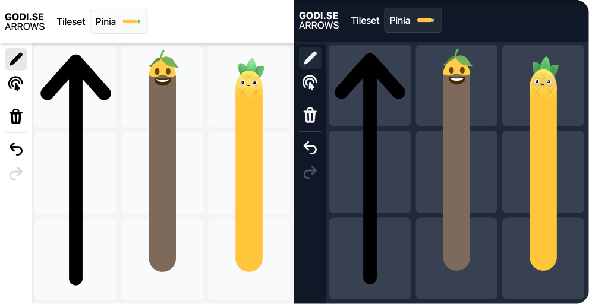
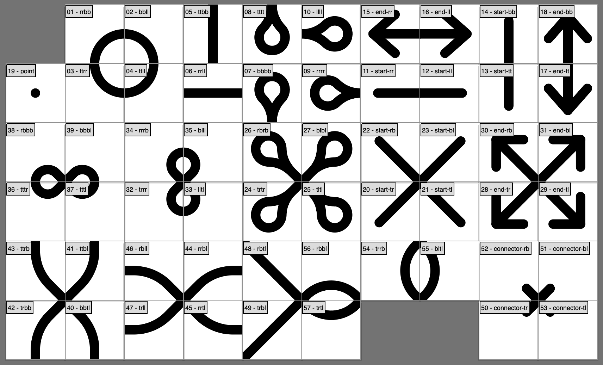
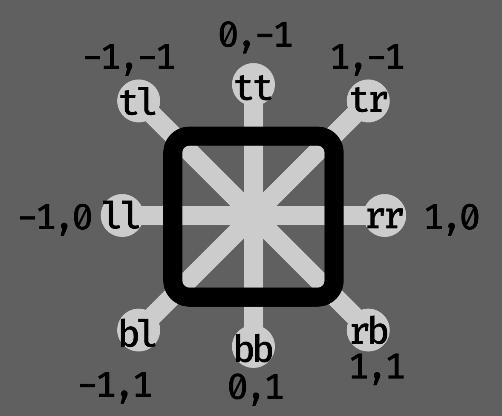

# Arrow Canvas

*Try out the project live at [arrows.godi.se](https://arrows.godi.se)!*



Ever needed to draw arbitrarily arrows on a canvas? Probably not, yet with this project your are able to do so! Select from regular arrows or one of the fancier options: *lemoji* and *Pinia* and express yourself freely.

Supports both light and dark mode, so the programmers among us don't get blinded by the light.

## Dev setup

Wanna run this project locally and maybe even contribute? Here's how to get started:

```bash
git clone https://github.com/gustavwilliam/arrow-canvas.git
cd arrow-canvas
```

Then install the dependencies:

```bash
npm install
```

Useful commands:

```bash
# Start the development server
npm run dev

# Build the project
npm run build

# Serve the built project
npm run serve
```

## How it works

As a Vue.js enthusiast, the project is build with Vue 3 and Vite, with the rendering being done entirely using Vue's reactivity. State, like selected tool and cavnas selection, is stored using Pinia.

### Tilesets

The arrows are drawn using tilesets, which are essentially a set of images representing every combination of arrow direction and style. For every tileset set of images like below is created. This covers all possible combinations of arrow direction in 45 degree increments:



#### Tileset file names

To enable the app to easily find the correct tileset for a given situation, the tiles follow a strict pattern for their file names:

- **Default**: `<in><out>.svg`
- **Start caps**: `start-<out>.svg`
- **End caps**: `end-<out>.svg`

In the file names `<in>` and `<out>` are 2 character strings representing where the arrow is coming from and going to.



- In start and end caps, only `out` is specified, as the direction that the arrow is coming from / going to
- In default tiles, both `in` and `out` are specified. Whatever direction comes first in the following list is set as `in` and the other as `out`, ensuring consistent file names:
  1. `tt`
  2. `tr`
  3. `rr`
  4. `rb`
  5. `bb`
  6. `bl`
  7. `ll`
  8. `tl`

## Final remarks

This was a fun project to make, and hopefully it will be somewhat entertaining to you as well! I'm open to issues/PRs if you have fun ideas or find bugs. Enjoy!